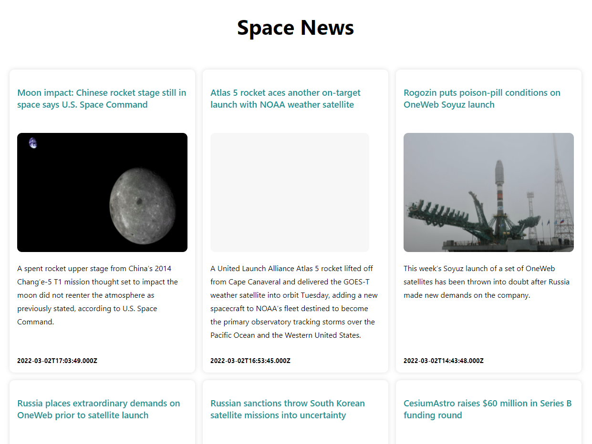

# Space News API Website

I built this with application [Space News API](https://www.spaceflightnewsapi.net/)

#### I learnt about the following in the project : 

- useEffect hook to make the API call.
- Using fetch api , to fetch data for space news articles.
- useState to store the fetched response inside of fetch.
- Array map method , to iterate over the array of objects recieved once fetch api promise is resolved.
- Displaying the articles with a CSS grid.
- Making the website responsive.

#### Demo

### Screenshot

